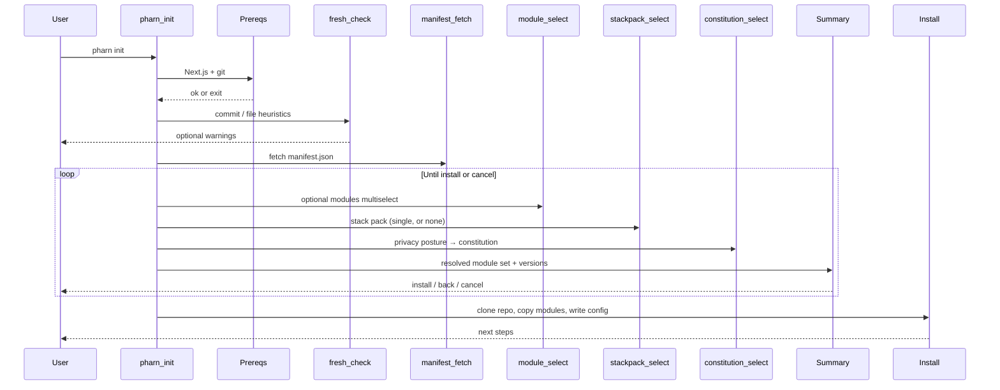

# pharn init

Interactive setup wizard. Default command when you run `pharn` with no subcommand.

```bash
pharn init
# equivalent
pharn
```

## Flow



> The diagram shows the **schemaVersion 1** flow. Against a **schemaVersion 2** manifest the CLI runs the wizard flow below before the methodology/stack/constitution steps.

## schemaVersion 2 wizard

When the fetched `manifest.json` is `schemaVersion 2`, `init` first asks how to configure your stack:

- **Default** — every per-technology answer is taken from `manifest.wizard.defaults`; no per-tech questions are asked.
- **Custom** — each wizard section (database, ORM, auth, …) is rendered as a single-select. Options are hidden, relabeled, or whole questions skipped based on your earlier answers (the manifest's `rules`); `(coming soon)` options are shown but not selectable; soft warnings confirm risky combinations.

After the stack questions it continues with the methodology multiselect (which excludes the `pharn-skills-*` category modules), stack pack, and constitution as below, then a **vendor-skills consent** step (records consent for vendor official skills; external fetch is [Coming soon](../roadmap.md)). The summary additionally lists the per-technology skills, and install copies only those skill folders into `.claude/skills/`. Your answers and installed skills are written to `pharn.config.json` (`stackAnswers`, `installedSkills`, `vendorSkills`).

## Steps

### 1. Banner and intro

Shows the PHARN logo and CLI version.

### 2. Prerequisites

Hard requirements. See [Getting started](../getting-started.md#prerequisites).

- Next.js in `package.json`
- `.git` present

### 3. Fresh check

Soft warnings based on git history and file layout. Thresholds:

| Condition | Message intent |
| --------- | -------------- |
| `git rev-list --count HEAD` >= 6 | Significant history (only this warning) |
| commit count 2–5 | Existing commits; may conflict with structure |
| 0 commits and > 3 custom root/app files | Project already customized |

Default for "Continue anyway?" is **no** (false).

### 4. Module catalog

Fetches `manifest.json` from `raw.githubusercontent.com/pharn-dev/pharn-oss/main/manifest.json`. This drives the wizard options (module names, descriptions, versions) and dependency resolution. If the fetch fails, the CLI exits — re-run with `PHARN_DEBUG=1` for details.

### 5. Module select

A multiselect of **optional** modules (required modules and stack-pack bases are excluded). `pharn-core` is always installed. All optional modules are pre-selected by default.

### 6. Stack pack select

A single choice among the available stack packs (currently `pharn-stack-nextjs`), or **None**. Stack packs are mutually exclusive; the chosen pack's dependencies (e.g. the React base) are pulled in automatically.

### 7. Privacy posture / constitution

Maps your answer to a constitution variant shipped in `pharn-core/templates/constitution/`:

| Answer | Variant | Principles |
| ------ | ------- | ---------- |
| GDPR / EU users / strict compliance | `gdpr-strict` | 1–6 |
| Standard SaaS with user data | `standard` | 1–4 |
| Internal tools / B2B, no end-user PII | `minimal` | 2–4 |

### 8. Summary

Displays the **resolved** module set (your selections plus all transitive dependencies, with versions), the skills version, and the constitution variant. Then:

| Action | Result |
| ------ | ------ |
| Yes, install | Clone the repo and install |
| Go back and change something | Re-run the selection steps, keeping your previous answers |
| Cancel | Exit 0; nothing written |

### 9. Install

| Action | Behavior |
| ------ | -------- |
| Clone `pharn-dev/pharn-oss` | Whole repo into a temp dir (via degit) |
| Resolve modules | From the cloned `manifest.json` — dependencies + exclusivity |
| Copy modules | Each module's `installs` map merged into `.claude/` |
| Materialize core | `memory-bank/` and the chosen `CONSTITUTION.md` |
| Pin commit SHA | Best-effort via the GitHub API (null if unavailable) |
| Write `pharn.config.json` | `skillsVersion`, `commit`, `modules`, `constitution` |

Overwrite prompt if `pharn.config.json` already exists (default: do not overwrite).

On success, the CLI suggests opening Claude Code and running `/pharn-plan`.

## Related

- [pharn.config.json](../reference/pharn-config.md)
- [add command](add.md)
- [Troubleshooting](../troubleshooting.md)
