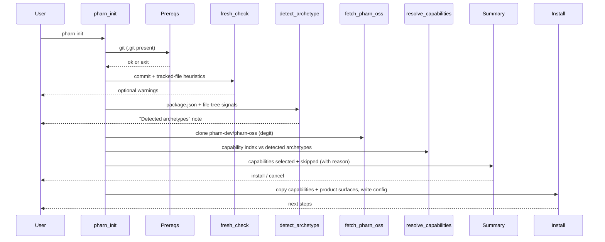

# pharn init

Interactive setup wizard. Default command when you run `pharn` with no subcommand.

```bash
pharn init
# equivalent
pharn
```

`init` detects your project's **archetype(s)** and installs the PHARN **capabilities** that apply to them. It fetches nothing you did not ask for: only the capabilities matching your project, plus the fixed product surfaces (commands, hooks, docs, contracts, floor), are copied. There is no module catalog and no `manifest.json` fetch — capabilities are the install unit.

> The `--archetype` flag is a **deprecated no-op** kept for one release: archetype detection is now the default, so `pharn init --archetype` behaves identically to `pharn init`.

## Flow



## Archetypes and capabilities

- **Archetype** — a closed set describing what your project is: `ssr`, `backend`, `spa`, or `lib` (the frameworkless base). Detection merges two untrusted-but-name-only fact sources — your `package.json` dependency **names** and **file-tree** structural signals (e.g. a `.tsx` file → `spa`) — then applies the archetype rule once. It is deterministic: the same project always yields the same archetypes. A wholly signal-less project resolves to `lib`.
- **Capability** — one griller or lens (an auditor PHARN ships). Each declares `applies: 'universal'` (always selected) or a set of archetypes. A capability is **selected** iff it is universal or its `applies` set intersects your detected archetypes; otherwise it is **skipped**, with the reason shown.

## Steps

### 1. Banner and intro

Shows the PHARN logo and CLI version.

### 2. Prerequisites

- **`.git` present** — checked up front, before anything else (universal, framework-agnostic). Hard-fails if absent.

### 3. Fresh check

Soft warnings based on git signals only (framework-neutral). Thresholds:

| Condition | Message intent |
| --------- | -------------- |
| `git rev-list --count HEAD` >= 6 | Significant history (only this warning) |
| commit count 2–5 | Existing commits; may conflict with structure |
| 0–1 commits and `git ls-files` > 40 | Populated repo, not a fresh scaffold |

Default for "Continue anyway?" is **no** (false).

### 4. Detect archetypes

Reads `package.json` dependency names and walks the project tree (bounded, symlink-safe, `node_modules`/`.git`/`dist`/`build` skipped) for structural signals, then reduces both to an `Archetype[]`. The detected set is shown in a "Detected archetypes" note. Only names are tested against fixed in-code allowlists — no discovered file body is read (other than `package.json`) and no untrusted value is executed, interpolated, or logged.

### 5. Fetch PHARN

Clones `pharn-dev/pharn-oss` into a temp dir via degit. If the fetch fails, the CLI exits — re-run with `PHARN_DEBUG=1` for details. The temp clone is always cleaned up (even on cancel or error).

### 6. Resolve capabilities

Parses the capability index from the fetched clone and selects the capabilities that apply to your archetypes (universal + archetype-matched), in the index's declared order. Skipped capabilities are kept with a reason (e.g. `applies to [backend]; detected [ssr]`).

### 7. Summary

Lists the **selected** capabilities (name, role, and why — `universal` or the matched archetype) and the **skipped** ones (with reason). Then:

| Action | Result |
| ------ | ------ |
| Yes, install | Copy the capabilities + product surfaces and write config |
| Cancel | Exit 0; nothing written |

An overwrite prompt appears first if `pharn.config.json` already exists (default: do not overwrite). A present-but-invalid existing config is reported by name rather than silently clobbered — `init` is the repair path.

### 8. Install

| Action | Behavior |
| ------ | -------- |
| Copy capabilities | Each selected griller/lens dir (with its `evals/`) → the mirrored project path |
| Copy product surfaces | `pharn-*.md` commands (not `pharn-dev-*`), `.cjs` hooks, the trusted docs, `pharn-contracts/`, and `.dev/floor/` (minus test files) |
| Preserve settings | An existing `.claude/settings.json` is **never** overwritten (a note tells you to wire the hooks by hand if needed) |
| Mirror the layout | Whichever layout the fetched clone uses — flat, or the relocated `pharn/` — is mirrored verbatim; the CLI never rewrites copied file contents |
| Pin commit SHA | Best-effort (the SHA the tree was pinned to; `null` if unavailable) |
| Write `pharn.config.json` | `skillsVersion` (from the repo's `SKILLS_VERSION`), `commit`, `archetypes`, `capabilities`, `layout`, `models`, `seam`, `modules: []` |

The install copies pharn-oss's canonical `CONSTITUTION.md` verbatim — there is no privacy-posture / constitution-variant question in the archetype flow. Only capability contents are copied; the CLI never executes or parses them (your Claude Code runs them later).

On success, the CLI reports the capability count and suggests opening Claude Code and running `/pharn-plan`.

## Legacy configs

`init` always writes an **archetype** config, and every command is archetype-only. A pre-archetype **module**-based `pharn.config.json` (one with `modules[]` but no `capabilities[]`, from a much older release) is no longer supported: `add`, `remove`, `list`, `update`, and `status` detect it up front and exit with a message to re-run `pharn init` — there is **no** module/manifest fallback (live pharn-oss ships no `manifest.json`). The config schema is additive, so a legacy config's now-unused fields (`modules`, `constitution`, `stackAnswers`, `installedSkills`) still parse; only the absence of `capabilities[]` triggers the rejection.

## Related

- [pharn.config.json](../reference/pharn-config.md)
- [add command](add.md)
- [Troubleshooting](../troubleshooting.md)
