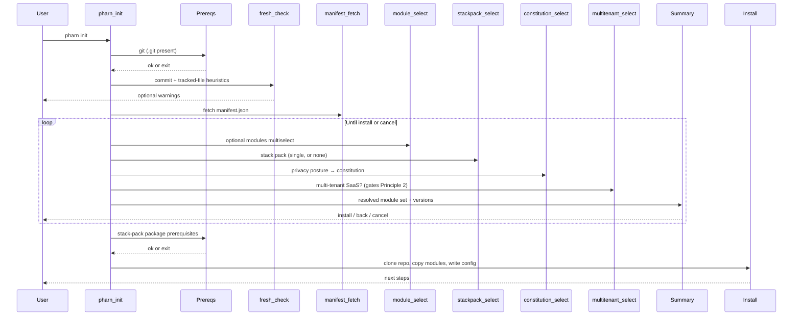

# pharn init

Interactive setup wizard. Default command when you run `pharn` with no subcommand.

```bash
pharn init
# equivalent
pharn
```

## Flow



> The diagram shows the **schemaVersion 1** flow. Against a **schemaVersion 2** manifest the CLI runs the wizard flow below before the methodology/stack/constitution steps.

## schemaVersion 2 wizard

When the fetched `manifest.json` is `schemaVersion 2`, `init` first reads your `package.json` and pre-fills the wizard from the manifest's detection metadata:

- **Stack pack** — preselected when every package a pack lists in `prerequisites` is present in `dependencies`/`devDependencies` (e.g. `next` → `pharn-stack-nextjs`); otherwise **None**.
- **Per-technology answers** — each question's answer is preselected when one of an option's `detect` packages is present (e.g. `drizzle-orm` → Drizzle, `@supabase/supabase-js` → Supabase). `(coming soon)` options are never auto-selected.

Detected values are shown in a "Detected from package.json" note; you can override every choice, and with no matches the wizard falls back to defaults / None.

`init` then asks how to configure your stack:

- **Default** — every per-technology answer is taken from `manifest.wizard.defaults`, overlaid with any detected answers (detection wins; undetected questions keep their default); the manifest's `hide`/`hideQuestion` rules are then applied so the result matches what Custom mode would produce with every default accepted (a question a rule hides is recorded as `skip`, never installed). No per-tech questions are asked.
- **Custom** — each wizard section (database, ORM, auth, …) is rendered as a single-select with detected answers pre-checked. Options are hidden, relabeled, or whole questions skipped based on your earlier answers (the manifest's `rules`); `(coming soon)` options are shown but not selectable; soft warnings confirm risky combinations.

After the stack questions it continues with the methodology multiselect (which excludes the `pharn-skills-*` category modules), stack pack, constitution, and the **multi-tenant SaaS** flag as below, then a **vendor-skills consent** step (records consent for vendor official skills). On install, consented skills with a known source are fetched automatically from the vendor's registry into `.claude/skills/`; those without a source are flagged **(manual install)**, and any single fetch failure is non-fatal. The summary additionally lists the per-technology skills, and install copies only those skill folders into `.claude/skills/`. Your answers and installed skills are written to `pharn.config.json` (`stackAnswers`, `installedSkills`, `vendorSkills`).

## Steps

### 1. Banner and intro

Shows the PHARN logo and CLI version.

### 2. Prerequisites

Hard requirements. See [Getting started](../getting-started.md#prerequisites).

- **`.git` present** — checked up front, before the wizard (universal, framework-agnostic).
- **Stack-pack packages** — after you pick a stack pack, every package it declares in the manifest's `prerequisites` must be in `package.json` (`dependencies`/`devDependencies`). Validated just before install, only for the pack you chose: **None** or a non-Next pack needs no framework package, while `pharn-stack-nextjs` requires `next`. The failure message is the manifest's own `reason`.

### 3. Fresh check

Soft warnings based on git signals only (framework-neutral). Thresholds:

| Condition | Message intent |
| --------- | -------------- |
| `git rev-list --count HEAD` >= 6 | Significant history (only this warning) |
| commit count 2–5 | Existing commits; may conflict with structure |
| 0–1 commits and `git ls-files` > 40 | Populated repo, not a fresh scaffold |

Default for "Continue anyway?" is **no** (false).

### 4. Module catalog

Fetches `manifest.json` from `raw.githubusercontent.com/pharn-dev/pharn-oss/main/manifest.json`. This drives the wizard options (module names, descriptions, versions) and dependency resolution. If the fetch fails, the CLI exits — re-run with `PHARN_DEBUG=1` for details.

### 5. Module select

A multiselect of **optional** modules (required modules and stack-pack bases are excluded). `pharn-core` is always installed. All optional modules are pre-selected by default.

### 6. Stack pack select

A single choice among the available stack packs (currently `pharn-stack-nextjs`), or **None**. The initial selection is the pack detected from `package.json` (see the wizard section above), or **None** when nothing matches. Stack packs are mutually exclusive; the chosen pack's dependencies (e.g. the React base) are pulled in automatically.

### 7. Privacy posture / constitution

Maps your answer to a constitution variant shipped in `pharn-core/templates/constitution/`:

| Answer | Variant | Principles |
| ------ | ------- | ---------- |
| GDPR / EU users / strict compliance | `gdpr-strict` | 1–6 |
| Standard SaaS with user data | `standard` | 1–4 |
| Internal tools / B2B, no end-user PII | `minimal` | 2–4 |

### 8. Multi-tenant SaaS

"Is this a multi-tenant SaaS?" — recorded as `isMultiTenant` in `pharn.config.json` (default **Yes**). It gates **Principle 2 (Multi-Tenant Isolation)** in the installed constitution:

- **Yes** (default) — the chosen constitution variant is installed verbatim, including Principle 2.
- **No** — Principle 2 is stripped from the copied `CONSTITUTION.md`: its `## Principle 2` section is removed and `2` is dropped from the `principles_included` frontmatter, so a non-SaaS project is not blocked by a principle that does not apply. Every other principle and the file's structure are unchanged.

### 9. Summary

Displays the **resolved** module set (your selections plus all transitive dependencies, with versions), the skills version, the constitution variant, and whether the project is a multi-tenant SaaS. Then:

| Action | Result |
| ------ | ------ |
| Yes, install | Clone the repo and install |
| Go back and change something | Re-run the selection steps, keeping your previous answers |
| Cancel | Exit 0; nothing written |

### 10. Install

| Action | Behavior |
| ------ | -------- |
| Clone `pharn-dev/pharn-oss` | Whole repo into a temp dir (via degit) |
| Resolve modules | From the cloned `manifest.json` — dependencies + exclusivity |
| Copy modules | Each module's `installs` map merged into `.claude/` |
| Materialize core | `memory-bank/` and the chosen `CONSTITUTION.md` (Principle 2 stripped when not a multi-tenant SaaS) |
| Pin commit SHA | Best-effort via the GitHub API (null if unavailable) |
| Write `pharn.config.json` | `skillsVersion`, `commit`, `modules`, `constitution`, `isMultiTenant` |

Overwrite prompt if `pharn.config.json` already exists (default: do not overwrite).

On success, the CLI suggests opening Claude Code and running `/pharn-plan`.

## Related

- [pharn.config.json](../reference/pharn-config.md)
- [add command](add.md)
- [Troubleshooting](../troubleshooting.md)
