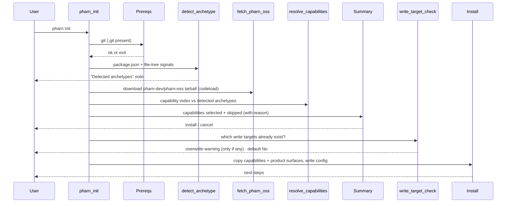

# pharn init

Interactive setup wizard. Default command when you run `pharn` with no subcommand.

```bash
pharn init
# equivalent
pharn
```

`init` detects your project's **archetype(s)** and installs the PHARN **capabilities** that apply to them. It fetches nothing you did not ask for: only the capabilities matching your project, plus the fixed product surfaces (commands, hooks, docs, contracts, `pharn-core`, floor), are copied. There is no module catalog and no `manifest.json` fetch — capabilities are the install unit.

> The `--archetype` flag is a **deprecated no-op** kept for one release: archetype detection is now the default, so `pharn init --archetype` behaves identically to `pharn init`.

## `init` is interactive-only

`init` always asks which capabilities to install, and — only when any of its write targets already
exist — whether to overwrite them, so it needs a terminal. Off a TTY (CI, a pipe, a script) it **exits 1**
with a usage error instead of prompting into a stream nobody is reading:

```console
$ echo "" | pharn init   # stderr shown inline
■ pharn init is interactive — run it in an interactive terminal. There is deliberately no --yes
  for init: it confirms before overwriting existing files, and auto-confirming that in a pipeline
  is what the prompt exists to prevent.
$ echo $?
1
```

The refusal happens **before the clone**, so a non-interactive `init` costs no network round-trip and
leaves your project untouched.

There is deliberately **no `--yes` for `init`** — unlike [`pharn update`](update.md), which has one. The
second of init's prompts is the destructive overwrite confirmation, and auto-confirming file overwrites
in a pipeline is precisely the hazard that prompt exists to prevent. `pharn init --yes` is therefore
**refused** (exit 1), not accepted and ignored — as is any other option `init` does not take, such as
`--force` or `--json`, and so is an extra positional (`pharn init extra` → `Unexpected argument`).
`--archetype` is `init`'s only option, and it is the deprecated no-op above.

A directory with no `.git` still gets its own, more useful error first (see **Prerequisites** below) —
the interactivity check never masks it.

## Flow



## Archetypes and capabilities

- **Archetype** — a closed set describing what your project is: `ssr`, `backend`, `spa`, or `lib` (the frameworkless base). Detection merges two untrusted-but-name-only fact sources — your `package.json` dependency **names** and **file-tree** structural signals (e.g. a `.tsx` file → `spa`) — then applies the archetype rule once. It is deterministic: the same project always yields the same archetypes. A wholly signal-less project resolves to `lib`.
- **Capability** — one griller or lens (an auditor PHARN ships). Each declares `applies: 'universal'` (always selected) or a set of archetypes. A capability is **selected** iff it is universal or its `applies` set intersects your detected archetypes; otherwise it is **skipped**, with the reason shown.

## When pharn cannot read a capability upstream

`init` fetches `pharn-dev/pharn-oss` at `main`, so a capability can be in a shape your installed
pharn version does not understand yet. `init` **skips that one capability and names it**, before the
summary you act on, then installs everything else normally:

```text
1 upstream capability could not be read and was SKIPPED — not installed:
  griller:backwards-compat (pharn/pharn-pipeline/grillers) — missing its markdown backwards-compat/backwards-compat.md.
```

Nothing under that capability's directory is copied into your project, and it is not recorded in
`pharn.config.json`. Upgrading (`npm install -g @pharn-dev/pharn@latest`) usually resolves it.

Separately, if pharn-oss ships a root `MIN_CLI` file declaring a **minimum pharn version** newer than
yours, `init` refuses before any prompt or write, cleans up the clone, and exits 1 — see
[`pharn add`](add.md#pharn-is-too-old-for-the-current-pharn-oss).

## Steps

### 1. Banner and intro

Shows the PHARN logo and CLI version.

### 2. Prerequisites

- **`.git` present** — checked up front, before anything else (universal, framework-agnostic). Hard-fails if absent.

### 3. Detect archetypes

Reads `package.json` dependency names and walks the project tree (bounded and symlink-safe, skipping dependencies, VCS metadata, and build/deploy caches — `node_modules`, `.git`, `dist`, `build`, `out`, `coverage`, `storybook-static`, `.next`, `.nuxt`, `.svelte-kit`, `.astro`, `.turbo`, `.vercel`, `.cache`, `.parcel-cache`) for structural signals, then reduces both to an `Archetype[]`. Skipping those trees costs the walk nothing, so a large framework cache cannot exhaust its bound and hide your real source; the tradeoff is that a signal file you hand-authored inside one of those directories is not seen. The detected set is shown in a "Detected archetypes" note. Only names are tested against fixed in-code allowlists — no discovered file body is read (other than `package.json`) and no untrusted value is executed, interpolated, or logged.

### 4. Fetch PHARN

If a proxy is configured in your environment, `init` warns first: `pharn` uses Node's global `fetch`,
which reads no proxy variable on any platform, so a proxy-only network fails as an unexplained timeout
unless you are told. Resolves the branch head via the GitHub API, then downloads that exact commit's tarball from `codeload.github.com` and extracts it into a temp dir. If the fetch fails — or the archive contains an entry `pharn` refuses to extract — the CLI exits; re-run with `PHARN_DEBUG=1` for details. The temp clone is always cleaned up — on success, on error, on cancel, and on Ctrl-C or a `SIGTERM` mid-clone — and `pharn` keeps no download cache. An interrupted run also exits **130** (or 143 for `SIGTERM`) rather than reporting success.

If the fetched version declares a `MIN_CLI` newer than your CLI, `init` stops here with a named error
and writes nothing.

### 5. Resolve capabilities

Parses the capability index from the fetched clone and selects the capabilities that apply to your archetypes (universal + archetype-matched), in the index's declared order. Skipped capabilities are kept with a reason (e.g. `applies to [backend]; detected [ssr]`).

### 6. Summary

Lists the **selected** capabilities (name, role, and why — `universal` or the matched archetype) and the **skipped** ones (with reason). Then:

| Action       | Result                                                    |
| ------------ | --------------------------------------------------------- |
| Yes, install | Copy the capabilities + product surfaces and write config |
| Cancel       | Exit 0; nothing written                                   |

After you choose **install**, `init` checks which of its **actual write targets** (the selected capability dirs, product `pharn-*` commands, `.cjs` hooks, `pharn/features/README.md`, the contracts, core and floor dirs, the trusted docs, pharn's `LICENSE` copy, and `pharn.config.json`) already exist in your project. If any do, it lists them (capped at 10, then "…and N more") and asks you to confirm before overwriting — default **no**. When `pharn.config.json` is one of them, the warning also names the `skillsVersion` your existing config records, so you can see which version you are about to replace (read locally, never fetched; the clause is simply omitted if that file cannot be read). If none do, there is no prompt (zero friction). `.claude/settings.json` is never overwritten, so it is excluded from the check. The target set is derived from the fetched clone's layout + your resolved selection (`lib/install-manifest.ts`), so it is exact — not a git-history heuristic.

### 7. Install

| Action                     | Behavior                                                                                                                                                                                                                                                           |
| -------------------------- | ------------------------------------------------------------------------------------------------------------------------------------------------------------------------------------------------------------------------------------------------------------------ |
| Copy capabilities          | Each selected griller/lens dir (with its `evals/`) → the mirrored project path                                                                                                                                                                                     |
| Copy product surfaces      | `pharn-*.md` commands (not `pharn-dev-*`), `.cjs` hooks, the trusted docs, `pharn/features/README.md`, and the contracts, `pharn-core` and floor dirs — each at the fetched layout (minus test files and `test-fixtures/`)                                               |
| Preserve settings          | An existing `.claude/settings.json` is **never** overwritten (a note tells you to wire the hooks by hand if needed)                                                                                                                                                |
| Mirror the layout          | Whichever layout the fetched clone uses is mirrored verbatim; the CLI never rewrites copied file contents. Today that is `pharn/pharn-contracts/`, `pharn/pharn-core/`, `pharn/floor/`; the legacy flat layout is `pharn-contracts/`, `pharn-core/`, `.dev/floor/` |
| Pin commit SHA             | Best-effort (the SHA the tree was pinned to; `null` if unavailable)                                                                                                                                                                                                |
| Write `pharn.config.json`  | `pharnVersion`, `skillsVersion` (from the repo's `SKILLS_VERSION`), `repo`, `commit`, `installedAt`, `archetypes`, `capabilities` (each stamped `source: "auto"` — only `pharn add` writes `manual`), `layout`, `models`, `seam`, `modules: []`                    |
| Write `pharn.records.json` | A sha256 of every file the install wrote, so [`pharn update`](update.md) can keep your later edits ([reference](../reference/pharn-records.md))                                                                                                                    |

The install also copies pharn-oss's Apache-2.0 `LICENSE` — to `pharn/LICENSE`, or `PHARN-LICENSE` at
the root in the legacy flat layout. The destination is deliberately **not** a plain root `LICENSE`:
that file is yours, and pharn never overwrites it. The copy exists so that a repo you commit and
publish carries the license grant for the ~450 Apache-2.0 files pharn put in it.

The install copies pharn-oss's canonical `CONSTITUTION.md` verbatim — there is no privacy-posture / constitution-variant question in the archetype flow. Only capability contents are copied; the CLI never executes or parses them (your Claude Code runs them later).

On success, the CLI reports the capability count and suggests opening Claude Code and running `/pharn-spec` — intent capture for your first feature, which feeds `/pharn-plan`.

## Concurrency

`init` takes the project lock (`.pharn.lock`) **after** both of its prompts and holds it across the
write, releasing it in the same step that disposes of the temp clone. A second `pharn` writer refuses
with a named message and exit 1 rather than queueing; `pharn list` and `pharn status` are never
blocked by it.

Two consequences are deliberate. Because the lock is taken late, a second writer racing `pharn init`
still pays for the full download before being refused — accepted, because the alternative is holding
the lock across an unanswered human prompt. And because both prompts sit inside the run, a walked-away
`init` can block other writers until the six-hour staleness window expires. See
[Another pharn process is running](../troubleshooting.md#another-pharn-process-is-running).

## Legacy configs

`init` always writes an **archetype** config, and every command is archetype-only. A pre-archetype **module**-based `pharn.config.json` (one with `modules[]` but no `capabilities[]`, from a much older release) is no longer supported: `add`, `remove`, `list`, `update`, and `status` detect it up front and exit with a message to re-run `pharn init` — there is **no** module/manifest fallback (live pharn-oss ships no `manifest.json`). The config schema is additive, so a legacy config's now-unused fields (`modules`, `constitution`, `stackAnswers`, `installedSkills`) still parse; only the absence of `capabilities[]` triggers the rejection.

A config that is present but **invalid** — a malformed `models`/`seam` block, an out-of-enum
`capabilities[].source`, or JSON that does not parse — is a different case with its own named error and
exit 1. It deliberately does **not** say "run `pharn init`", because that would tell you to overwrite
the file you need to repair. See
[A command rejects an invalid config](../troubleshooting.md#a-command-rejects-an-invalid-config-does-not-say-run-init).

## Related

- [pharn.config.json](../reference/pharn-config.md)
- [pharn.records.json](../reference/pharn-records.md)
- [add command](add.md)
- [Troubleshooting](../troubleshooting.md)
